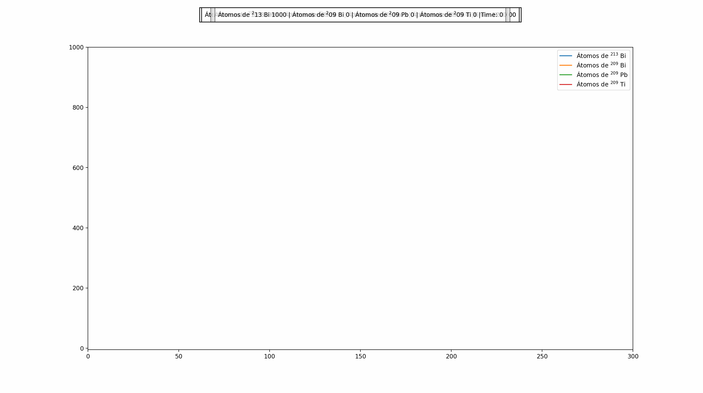

# In this repository I will add code of animation of differential equations and physics simulations

## Lotka-Volterra simulation

This is my first differential equation simulated, here you can see what it shows:

## Radiation chain decay

This is a monetecarlo simulation of a desintegration chain (Needs fixing the width of the figure)

